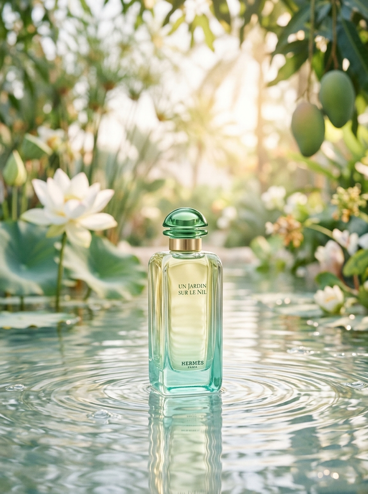

# Immersive Product Experience

An immersive product experience inspired by Hermès’ *Un Jardin sur le Nil*, exploring how storytelling, interaction, motion, and product information can work together in a digital interface.

本项目以 Hermès「Un Jardin sur le Nil / 尼罗河花园」为设计对象，尝试将实体产品的气味线索、材质感、品牌叙事与网页交互结合起来，形成一个兼具展示、浏览与信息探索的产品体验页面。

> This is an independent non-commercial design and front-end project.  
> It is not affiliated with, endorsed by, or sponsored by Hermès.

---

## Preview

> 建议在这里补充项目截图或部署链接。

```text
Live Demo: Coming soon
```



---

## Project Overview

`immersive-product-experience` 不是一个传统商品详情页，也不是单纯的视觉展示页。

它围绕一个具体产品，尝试拆解并重组以下内容：

- 产品第一印象
- 品牌与场景叙事
- 香调信息结构
- 滚动过程中的视觉反馈
- 展示页与详情页之间的浏览路径
- 动效、图像与文案之间的对应关系

项目希望呈现的是：  
**一个产品如何从静态商品图，转化为一段可浏览、可感知、可继续探索的数字体验。**

---

## Design Direction

Hermès「尼罗河花园」本身具有明确的感官线索：青芒果（Green Mango）、葡萄柚（Grapefruit）、尼罗河莲花（Lotus）、菖蒲（Calamus）、槭木（Sycamore Wood）与焚香（Incense），以及番茄茎（Tomato Stem）与胡萝卜（Carrot）等次级香气线索。这些元素并不适合被简单压缩成普通商品卡片。

因此，本项目没有直接采用“商品图 + 价格 + 购买按钮”的结构，而是将页面拆分为两个层级：

```text
Showcase
用于建立产品气质、场景记忆 and 浏览兴趣。

Detail
用于补充香调、系列、规格和产品信息。
```

这种结构让页面既有第一眼的情绪表达，也保留进一步理解产品的空间。

---

## Experience Structure

```text
Immersive Product Experience
├── Showcase
│   ├── Concept
│   ├── Genesis
│   ├── Opening Notes
│   ├── Heart Notes
│   ├── Drydown
│   └── Enter Detail
│
└── Detail
    ├── Inspiration
    ├── Scent Journey
    ├── Product Collection
    └── Footer
```

### Showcase

Showcase 页面以滚动叙事为主。用户随着页面滚动，依次看到产品概念、调香灵感、前调、中调和后调。

页面通过瓶身图像、水彩过渡、植物线稿和文字卡片之间的变化，营造一种由“产品外观”逐渐进入“气味想象”的过程。

### Detail

Detail 页面更接近产品信息页，用于承接 Showcase 之后的进一步浏览。

它包含产品灵感、香调探索、系列产品和基础页面信息，使项目不止停留在单页视觉展示，而是具备更完整的产品浏览结构。

---

## Design Goals

| Goal | Description |
| --- | --- |
| Build atmosphere first | 先建立产品气质与场景，再进入具体信息。 |
| Make scent easier to understand | 将前调、中调、后调拆分为可浏览的信息层级。 |
| Use motion as guidance | 让动效承担叙事节奏和视觉引导，而不是单纯装饰。 |
| Balance emotion and clarity | 在感性表达和信息清晰度之间保持平衡。 |
| Extend beyond a landing page | 通过 Detail 页面补充产品信息，使体验更完整。 |

---

## Key Interactions

### 1. Scroll-based storytelling

Showcase 页面使用滚动进度驱动内容切换。文字、图像和线稿不会一次性出现，而是随着用户滚动逐步展开。

这种方式使香调变化具有时间感，也让用户在浏览过程中逐渐进入产品故事。

### 2. Bottle dissolve effect

瓶身图像在滚动过程中逐渐淡出，并伴随模糊、位移和色彩层次变化。

这一效果不是为了模拟真实物理过程，而是为了表达从“实体瓶身”到“气味印象”的视觉转场。

### 3. Botanical line drawing

页面中的植物线稿会随着滚动逐步绘制，用来对应不同香调中的植物元素。

线稿和水彩感视觉共同构成一种轻量的手稿感，呼应香水灵感来源中的自然意象。

### 4. Scent journey interaction

Detail 页面中的香调模块将 Top Notes、Heart Notes 和 Base Notes 拆分为可切换内容。

用户可以在不同香调之间切换，查看对应香材、描述和视觉元素，从而更清楚地理解产品结构。

---

## Information Architecture

项目的信息结构主要围绕两个问题展开：

1. 用户如何被产品吸引？
2. 用户被吸引后，如何继续理解产品？

因此，页面没有把所有信息堆叠在同一屏，而是通过 Showcase 与 Detail 进行分层。

```text
First impression
→ Story and atmosphere
→ Scent structure
→ Product details
→ Collection information
```

这种结构可以避免页面过早进入商品参数，也能避免只有视觉展示但缺少信息深度。

---

## Visual and Motion Principles

### 1. Restraint

页面整体避免使用过多高强度动效。动效主要出现在滚动、转场、线稿绘制和内容显隐中。

### 2. Continuity

Showcase 和 Detail 使用一致的色调、图像风格和排版节奏，让用户从叙事页面进入详情页面时不会产生割裂感。

### 3. Product-led expression

视觉元素尽量从产品本身出发，例如瓶身、河流、植物、香调和材质，而不是额外添加与产品无关的装饰元素。

### 4. Readability

即使页面具有较强的视觉氛围，文字仍然需要保持可读，信息层级需要清楚。

---

## Tech Stack

| Area | Technology |
| --- | --- |
| Framework | React |
| Language | TypeScript |
| Build Tool | Vite |
| Styling | Tailwind CSS / CSS Variables |
| Motion | Framer Motion |
| 3D Experiment | Three.js |
| Icons | Lucide React |
| Linting | Oxlint |

---

## Project Structure

```text
immersive-product-experience
├── public/
│   ├── images/
│   │   ├── hermes_perfume.jpg
│   │   ├── jardin_bottle_box.png
│   │   ├── jardin_bottle_front.png
│   │   ├── jardin_bottle_nobg.png
│   │   ├── jardin_collection.jpg
│   │   ├── jardin_dry_oil.png
│   │   └── jardin_ingredients.png
│   ├── favicon.svg
│   └── icons.svg
│
├── src/
│   ├── assets/
│   ├── components/
│   │   ├── Footer.tsx
│   │   ├── Header.tsx
│   │   ├── HeroSection.tsx
│   │   ├── ProductGrid.tsx
│   │   ├── ScentJourney.tsx
│   │   ├── ShowcasePage.tsx
│   │   └── ThreeBottle.tsx
│   ├── App.css
│   ├── App.tsx
│   ├── index.css
│   └── main.tsx
│
├── index.html
├── package.json
├── tsconfig.json
├── tsconfig.app.json
├── tsconfig.node.json
└── vite.config.ts
```

---

## Local Development

### Install dependencies

```bash
npm install
```

### Start development server

```bash
npm run dev
```

### Build for production

```bash
npm run build
```

### Preview production build

```bash
npm run preview
```

### Run lint

```bash
npm run lint
```

---

## Current Status

The current version includes:

- Scroll-based showcase page
- Product detail page
- Header navigation
- Scent journey interaction
- Product collection cards
- Motion-based visual transitions
- Responsive navigation foundation
- Experimental Three.js bottle component

The Three.js bottle component is currently an experimental module and is not treated as the core experience of the current version.

---

## Future Improvements

- Add a live demo link after deployment
- Add screenshots and short interaction recordings
- Improve mobile layout and breakpoint details
- Add `prefers-reduced-motion` support
- Refine accessibility labels for motion and image-heavy sections
- Continue improving the Detail page information structure
- Evaluate whether the experimental 3D bottle component should be integrated into the main experience
- Add a separate design notes document for process, iteration, and trade-offs

---

## Notes on Content and Assets

This project references Hermès「Un Jardin sur le Nil」as a design subject. Product names, trademarks, fragrance information, images, and related brand assets belong to their respective owners.

The project is created for non-commercial learning, design exploration, and front-end practice only.
