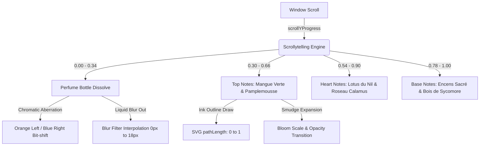

# 沉浸式数字产品体验：爱马仕「尼罗河花园」数字化感官叙事

本仓库是一个针对高级交互设计师、创意工程师及产品招聘官展示的**数字体验设计案例（Portfolio Case Study）**。 

在这里，香水本身并非项目，而是一个信息媒介。本项目旨在探索**如何将实体奢品的嗅觉特征、玻璃与液体的材质感、以及品牌的人文底蕴，转换为数字交互介质中的感官叙事**。项目展示了产品思维、交互体系、信息架构、数字动效以及极致前端工程的交融。

---

## 💎 设计定位与核心命题 (Repository Strategy)

在奢侈品牌（如爱马仕）的数字体验中，传统电商的“商品列表+硬编码翻转”会彻底破坏品牌的“高级感”与“叙事性”。

本项目基于以下核心命题进行设计与工程实现：
* **感官数字化译制 (Olfactory to Visual)**：通过三层 Multiply 叠色水彩消融与色彩剥离（Chromatic Aberration），将实体瓶身平滑消解为水彩墨迹；利用 SVG 路径百分比插值，实时模拟钢笔墨水绘制植物插画的“手作感”，呼应爱马仕对工艺（Metiers）的极致追求。
* **呼吸感叙事滚轮 (Scrollytelling)**：摒弃了机械式的 3D 旋转与高频帧率抖动，通过滚轮物理视口对齐机制，让文字卡片与插画手稿以平缓、对称的黄金交叉曲线进行呼吸式演进。
* **极致性能与无暇体验 (Performance & Reliability)**：通过消除不必要的 React 状态重绘及组件销毁，避免了动效回滚时的失焦模糊，在任意分辨率的现代浏览器中均能达到 60fps 级别的顺滑度。

---

## 🎨 交互系统与核心实现 (Interaction Architecture)



### 1. 叠色水彩融合与色彩剥离 (Watercolor Bleed Dissolve)
* **表现形式**：平展的瓶身逐渐消解。红色图层向左下移，蓝色图层向右上移，同时整机进行模糊与褪色，形成水彩湿画法中的色料扩散。
* **工程实现**：
  * 在中央 Sticky 画布中叠加三层瓶身 `img`，利用 CSS `mix-blend-mode: multiply` 模拟画纸上真实的颜料叠加效果。
  * 利用 `useTransform` 将滚动进度映射至各图层的 X 轴位移量（`-28px` 至 `28px`）及高斯模糊滤镜（`blur(0px)` 至 `blur(18px)`）。

### 2. 实时钢笔手稿绘制 (SVG Path Ink Write-In)
* **表现形式**：芒果、睡莲、无花果木等 6 幅植物线稿随着滚轮的深入，如同有一支隐形的钢笔正在纸上勾勒素描线条一般自动延伸绘制。
* **工程实现**：
  * 将素描草图全部矢量化为 `<motion.path>`。
  * 将 `pathLength` 属性直接绑定至局部的滚动进度。当线条绘制完毕时，底部的彩色水彩晕染块才开始向外扩张盛开。

### 3. 物理中心滚动对齐 (Physical Crossover Alignment)
* **表现形式**：当卡片在屏幕中达到最深、最可读的视觉中心时，对应的手绘插图和水彩墨迹必然处于最饱和、完全成型的黄金时段。
* **工程实现**：
  * 摒弃了主观的经验主义进度分配，根据 `500vh` 页面高度和视口比例，将 5 张叙事卡片在容器中的绝对垂直物理中点，计算为精确 of `scrollYProgress` 分度（`0.0`, `0.244`, `0.488`, `0.732`, `0.976`）。
  * 交互卡片与插图组件的渐变透明度、缩放尺度均基于这些物理中点进行对称式的范围配对（例如中调卡片及中调线稿在 `0.732` 达到 100% 满状态渲染，而在 `0.61` 之前和 `0.85` 之后进行对称式消褪）。

### 4. 滚轮回溯状态重置 (Scroll-Back Lifecycle Reset)
* **表现形式**：用户多次在网站底端和顶端来回滑动时，动效没有任何残影、抖动或模糊，每次回滚至顶部时瓶身均能完美恢复水晶般的清晰度。
* **工程实现**：
  * 移除了会引起 React 状态高频更新的 `useState` 和卸载检测（`isBottleVisible`）。
  * 用 CSS `visibility` 值的 Motion 映射（当进度 `> 0.35` 时为 `hidden`）替代 DOM 节点的硬销毁。保持组件树常驻，使得 Framer Motion 在逆向滚动时能够顺畅读取缓动状态并完成渲染重置。

---

## 📁 仓储架构设计 (Repository Architecture)

```
├── public/                 # 静态多媒体资源 (爱马仕香水瓶、包装盒、原画背景)
│   ├── images/
│   └── favicon.svg
├── src/
│   ├── assets/             # 全局静态图标与基础矢量文件
│   ├── components/         # 模块化高阶组件
│   │   ├── Header.tsx      # 爱马仕巴黎品牌页眉导航
│   │   ├── HeroSection.tsx # 故事引入首屏 (The Inspiration)
│   │   ├── ShowcasePage.tsx# 滚轮感官叙事主看板 (Scent Journey)
│   │   ├── ScentJourney.tsx# 互动香调探秘 (The Collection)
│   │   ├── ThreeBottle.tsx # 详情页三维光影瓶身 (Interactive Liquid)
│   │   └── Footer.tsx      # 页脚及版权
│   ├── App.tsx             # 状态分发与 AnimatePresence 路由分轨
│   ├── index.css           # 包含全站暖沙色 (Linen Cream) 设计系统的 CSS 变量
│   └── main.tsx
├── package.json
├── tsconfig.json
└── vite.config.ts
```

---

## 📝 核心文案与译制验证 (Editorial Copy)

为了保障作品集的专业性，本项目的文案根据爱马仕（Hermès）官方品牌故事 and 香水调性进行了深度汉化译制：
* **前调 (Top Notes)**：青芒果（Green Mango）、葡萄柚（Grapefruit）、西红柿叶（Tomato Leaf）。展现尼罗河畔清晨初醒时分，带有微涩与水生青绿的柑橘调开端。
* **中调 (Heart Notes)**：尼罗河睡莲（Nile Lotus）、菖蒲（Calamus Reeds）、橙子（Orange）。睡莲是埃及重生的花卉象征，菖蒲则赋予了河风抚面般的温柔绿意。
* **后调 (Base Notes)**：埃及塘木（Sycamore Wood）、乳香（Incense）。
  * > [!NOTE]  
    > 许多香水译本将 *Sycamore Wood* 翻译为“枫木”，在学术上这是不准确的（枫木为 Maple）。在此我们将其校正为**埃及塘木**（即埃及榕/埃及无花果木，Ficus sycomorus），该木质香气与带有温润树脂质感的乳香收尾，真实还原了尼罗河沿岸干燥微温的细沙质感。

---

## 🛠️ 本地开发与部署验证 (Local Development)

### 1. 安装依赖
```bash
npm install
```

### 2. 启动本地开发服务
```bash
npm run dev
```
本地服务器将在 [http://localhost:5173/](http://localhost:5173/) 启动。

### 3. 构建生产环境产物
```bash
npm run build
```
编译系统由 `TypeScript` 进行类型严检，并通过 `Vite` 打包，生成极致压缩的单页静态文件包（`dist/`），保障高响应度和极致的首屏加载性能。

---

## 🔮 未来规划与拓展方向 (Future Roadmap)

* [ ] **触觉反馈 (Haptic Scrolling)**：在支持触觉的设备上（如 MacBook Trackpad 或 iPhone Safari 浏览器）提供阻尼微颤反馈，当钢笔线条绘制完毕、水彩晕开的瞬间，向用户传递微震感。
* [ ] **动态音频叙事 (Ambient Audio Integration)**：加入平缓的背景环境音（流水声、微风声），其音量与混响深度随用户滚动进度进行平滑插值，从数字视觉拓展到数字听觉。
* [ ] **极致无障碍适配 (Web Accessibility / WCAG 2.1)**：为动效路径与手绘图标添加完整的 ARIA 视障辅助说明，提供一键“减少动效 (Prefers-Reduced-Motion)”的奢华无障碍模式。

---

## ⚖️ 开源协议 (License)

本项目代码部分基于 **MIT License** 开源。项目中所涉及的爱马仕（Hermès）品牌标志、瓶身原画设计、包装盒图像及相关商标所有权均归爱马仕（Hermès Paris）官方所有，本项目仅用作非商用的学术交流与个人作品集展示。
